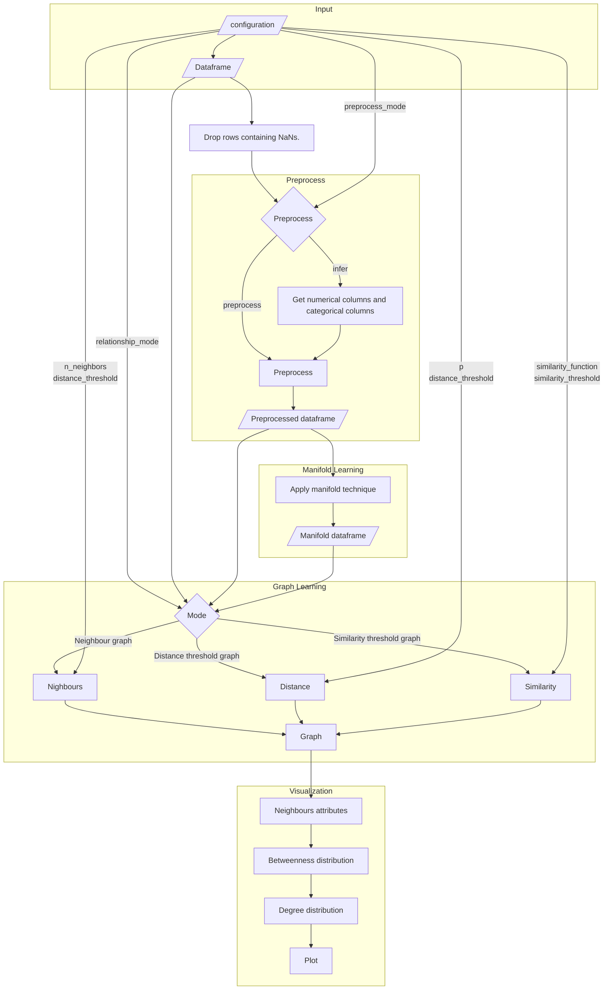

# Manifold Table Graph

A Python library for creating a graph representation of tabular data.

## Features

- **Distance Metrics:** Evaluate distances between data points using user-defined metrics.
- **Manifold Learning:** Implement manifold learning techniques using user-defined methods.
- **Graph Creation:** Generate graphs using the NetworkX library with edges based on distance metrics.
- **Statistics on the learned graph:** Evaluate the neighbors correlation, degree distribution, betweeness distribution and communities composition.
- **Visualization:** Plot the graph to understand how different data is distributed
## Diagram


## Quickstart and Demo

### Downloading the Repository

To get started, clone the repository using the following command:

```bash
git clone https://github.com/davidetorre92/Manifold-Table-Graph
```
### Installing Requirements
Navigate to the repository directory and install the required dependencies using:
```bash
pip3 install -r requirements.txt
```
### Demo
```python
python bin/main.py
```

Will make a graph from the scikit learn's make blobs dataset.

## Configuration
### Preprocessing options
 * ```df_path```: Path to the dataframe.
 * ```preprocess_mode```: Preprocessing mode, either 'infer' or 'preprocess'. Use 'infer' if you are not sure which variables are categorical and set the ```unique_threshold``` accordingly. Otherwise use 'preprocess' and set the features name that will be treated as categorical via the . If there are not any categorical features, set this flag to 'preprocess' and ```categorical_cols``` to None.
 * ```unique_threshold```: this threshold represents the maximum ratio of unique values to the total number of rows a column can have before being considered numerical given that ```preprocess_mode``` is 'infer'.
 * ```categorical_cols```: the list of columns that will be threated as categorical when ```preprocess_mode``` is set to 'preprocess'.
 * ```scaler```: option to set the scaler to be applied to the remaining numerical columns. One among ['standard', 'minmax'].
 * ```preprocess_df_path```: path/to/preprocessed dataframe.
 * ```label_col```: column containing the label to be predicted, leave None for no predictions
 * ```ids_col```: column containing the id. Set to None where there are no ids and the row's id will be used.
 * ```pass_cols```: columns that should not be preprocessed.
 * ```drop_cols```: columns that won't take part to the model.
 * ```save_date_experiment```: whenever append the datetime of the experiment on the output files or not.

### Manifold learning options
 * ```technique```: name of the manifold learning technique to apply. Options are 'TSNE', 'Isomap', 'MDS', 'LLE
 * ```manifold_params```: a dict, parameters to pass to the manifold learning algorithm. None will use pre-set parameters.
 * ```manifold_df_path```: path/to/learned dataframe

### Graph learning options
 * ```relationship_mode```: the dataframe to use to learn the distance relationships. Can be `original` (original dataset), `preprocessed` (the preprocessed dataframe obtained by the preprocessing step specified above) or `manifold` (the dataset learned by the manifold learning technique specified above).
 * ```graph_mode```: option for the graph. Pick one among ['neighbors', 'distance', 'similarity'].
    * ```neighbors```: creates a graph where a limited number of close nodes in the feature space are connected.
        * ```graph_parameters``` dictionary. One can set:
            * ```n_neighbors```: This parameter specifies the number of nearest neighbors to consider for each node when constructing edges. The idea is to connect each node in the graph to its n_neighbors closest nodes based on the distance between their features in the processed dataset.
            * ```distance_threshold```: This optional parameter sets a maximum distance threshold for creating edges between nodes. If specified, an edge is only added between two nodes if the distance between them (based on their features) is less than or equal to this threshold.
    * ```distance```: creates a graph where closer nodes in the feature space are connected.
        * ```graph_parameters``` dictionary. One can set:
            * ```p```: int which Minkowski p-norm to use.
            * ```distance_threshold```: float, the threshold for adding an edge between two nodes.
    * ```similarity```: creates a graph where similar nodes in the feature space are connected.
        * ```graph_parameters``` dictionary. One can set:
            * ```similarity_function```: function, a custom function to compute the similarity between two points.
                        ```cos_sim``` is implemented for this task. In case of custom similarity function, make sure to specify them in utils.py and make sure that the input is function(p_1, p_2) and should return a float value in the range [0, 1].
            * ```similarity_threshold```: float, the threshold for adding an edge between two nodes based on similarity.

### Graph visualization options
 * ```graph_params```: dict, see above. None will use pre-set parameters.
 * ```plot_graph```: boolean value: to print or not the graph
 * ```graph_path```: path/to/graph object
 * ```graph_visualization_path```: path/to graph visualizzation
 * ```neigh_prob_path```: path/to neighbourhood data. In particular the probability of of encountering a label j node in the neighborhood of node with label i is displayed.
 * ```prob_heatmap_path```: path/to heatmap with neigh_prob_path
 * ```degree_distribution_outpath```: path/to degree distribution of the graph
 * ```betweenness_distribution_outpath```: path/to betweenness distribution of the path
 * ```community_composition_outpath```: path/to communtity composition of a graph. Communities are evaluated with Girvan Newman algorithm.

## Launching the with custom configuration
Once you set the variables in ```bin/config.py```, just exec:
```python
python bin/main.py
```

# Contacts
For any inquiries or futher discussion regarding this project, we invite to reach out to us. Our contacts are

- [Davide Torre](https://www.linkedin.com/in/davidetorre92/): d[dot]torre[at]iac[dot]cnr[dot]it; dtorre[at]luiss[dot]it
- [Davide Chicco](https://davidechicco.it): davidechicco[at]davidechicco[dot]it

