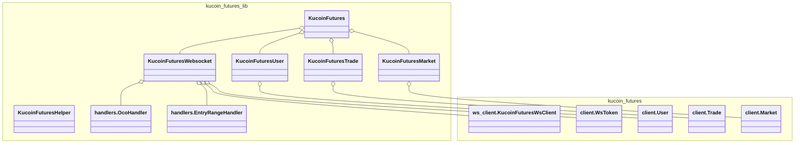

# Kucoin Futures Library

## Class Structure


## Usage Examples

```python
from kucoin_futures_lib import initialize_kucoinf

kucoinf = initialize_kucoinf(
    api_key='your-api-key',
    api_secret='your-api-secret',
    api_passphrase='your-api-passphrase',
)

account_overview = kucoinf.user.get_account_overview()
balance = account_overview["accountEquity"]
print(f"Account balance: {balance}")

# Create a market order with limit take profit and market stop loss
order_id = kucoinf.create_order(
    instrument="XBTUSDTM",
    side="buy",
    size=3,
    take_profit=75000,
    stop_loss=60000,
    leverage=10
)
print(f"Order ID: {order_id}")
```


