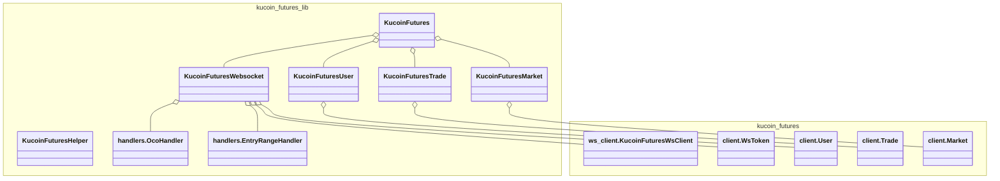

# Kucoin Futures Library

## Class Structure


## Usage Examples

```python
from kucoin_futures_lib import initialize_kucoinf
from kucoin_futures_lib.utils import retriable

retriable = retriable(retries=3, exceptions=(Exception,), backoff_base=2.0, initial_backoff=0.1)

kucoinf = initialize_kucoinf(
    api_key='your-api-key',
    api_secret='your-api-secret',
    api_passphrase='your-api-passphrase',
    retriable=retriable,  # Optional retriable method to retry methods in the library
)

balance = kucoinf.user.get_balance(currency='USDT')
print(f"Account balance: {balance}")


current_price  = kucoinf.market.get_current_price(instrument='XBTUSDTM')
print(f"Current price: {current_price}")

# Create a market order with limit take profit, market stop loss and enable Oco
order_id = kucoinf.create_order(
    instrument="XBTUSDTM",
    side="buy",
    size=3,
    take_profit=75000,
    stop_loss=60000,
    leverage=10,
    enable_oco=True,
)
print(f"Order ID: {order_id}")
```


