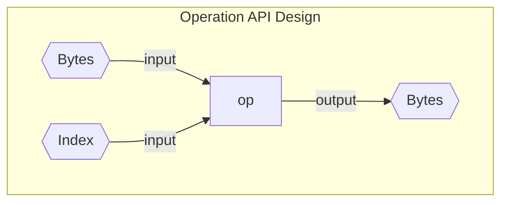
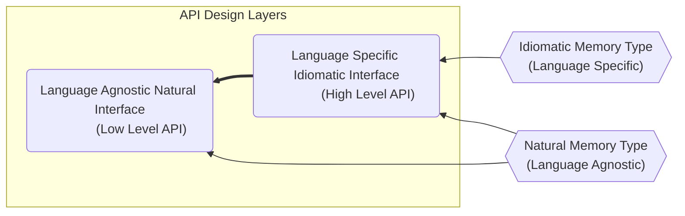
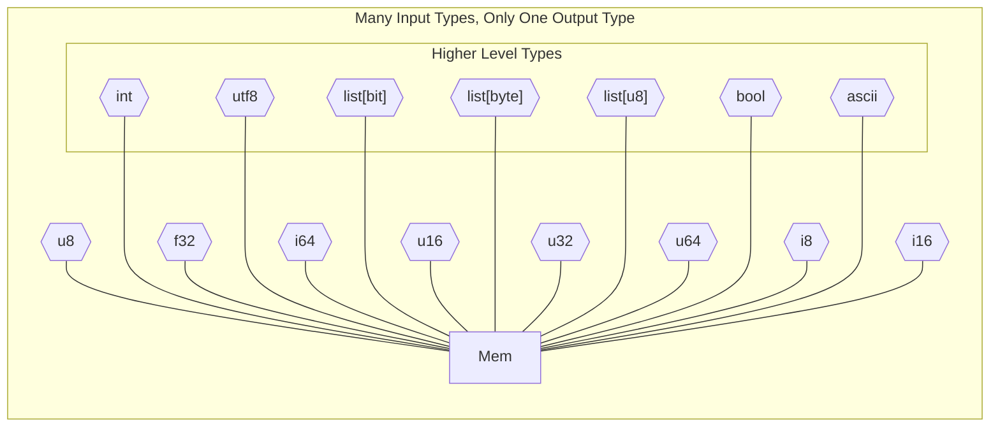
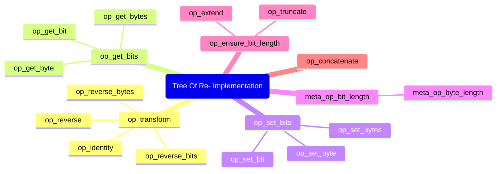
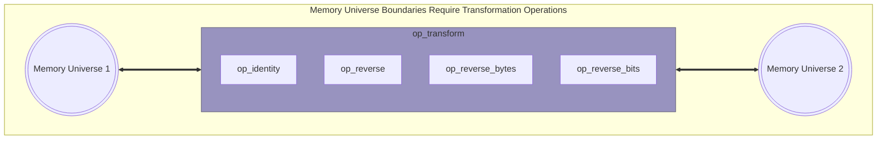

# Tidbytes Bit Manipulation Library

> **Memory manipulation reimagined with bit addressing**

Referring to the ninth bit of a region of memory should be trivial. It is, isn’t
it? It turns out that this is not as straightforward as it might seem. Depending
on the byte order, (referred to under the canonical moniker “endianness”), the
ninth bit may appear to the left or the right (not accounting for mixed
endianness) of the first bit (bit zero). The first byte should be the rightmost
byte for numeric data, but not when reading from a file for example. In this
case the first byte would be the leftmost byte. Because of all of this, I
designed Tidbytes to work specifically with bits as the primary addressable unit
of memory to provide clarity when working with memory from diverse sources.

The purpose of Tidbytes is to allow bits to be placed precisely where they are
wanted. In the pursuit of mapping this ideal to idiomatic types, some in-built
concepts were rediscovered. There really seems to be some fundamental types in
relation to mapping numeric data to bits. "Type" here refers to a collection of
related operations that either assumes metadata about an input or requires
metadata as a meta input. This represents an orientation that points away from
the operation and towards an operation respectively. Some concepts that relate
to operations that I've rediscovered are:

- **Unsized data** (inputs can be mapped to unlimited output data)
- **Sized data** (inputs can be mapped to output data limited by region size)
- **Natural data** (raw/untyped/uninterpreted/unmapped memory)
- **Numeric data** (mathematical identity or quantity)
- **Unsigned numbers** (axis with one polarity)
- **Signed numbers** (axis with two polarities)

These types are built into modern processor architectures via Bytes & Indices.
Tidbytes takes these natural computing concepts and provides 2 APIs:

- A lower level API designed to be easily re-implemented in other languages
- A higher level API designed to be as seamless as possible for Python
    programmers



Each operation in the lower level API takes Bytes & Indices as input and
produces Bytes as output or Indices if it is a meta operation. Using just Bytes
and Indices, all memory manipulation operations can be implemented because
Indices can represent offsets, lengths, ranges, slices, and (un)signed numbers.




## Idiomatic Higher Level API

The higher level "idiomatic" API provides these main types: `Mem`, `Unsigned`,
and `Signed`. The `Mem` type is the base type for all the other types and
provides the majority of the higher level functionality that will be comfortable
to Python programmers. It upholds contracts on invariants that are unique to
unsized or sized natural data in the form of raw bytes. The `Unsigned` type
upholds contracts on invariants unique to unsized or sized unsigned numeric
data. The `Signed` type upholds contracts on invariants unique to unsized or
sized signed numeric data.

```python
from tidbytes.idiomatic import *

mem = Mem[8]()  # <Mem [00000000]>
mem[0] = 1      # <Mem [10000000]>
mem[0:3]        # <Mem [100]>
mem += mem      # <Mem [10000000 10000000]>
mem[1::8]       # <Mem [10000000]>  Step by bytes

U2 = Unsigned[2]  # Type alias
def add(a: U2, b: U2) -> U2:
    return U2(a) + U2(b)

# Underflow and Overflow checks:
add(U2(2), U2(2))  # Error: 4 doesn't fit into bit length of 2 (min 0, max 3)

num = add(U2(2), U2(1))  # <Unsigned [11]>

# Fundamental type conversion support
int(num)  # 3
str(num)  # '11'
bool(num)  # True
float(num)  # 3.0
```

Each of the higher level types can be constructed from most of the types shown
here, although some types like `Unsigned` cannot be given a negative big integer
or a `Signed` memory region.

<!-- https://mermaid.js.org/syntax/flowchart.html#styling-line-curves -->


## Natural Lower Level API

The lower level "natural" API is much more verbose and not designed to follow
Python idioms but rather to conceptually model C-equivalent semantics when
possible. Although demonstrated here, the lower level API is not designed with
any user experience features by design, as that is the express role of the
higher level API. The goal of the lower level API is to make it easier to port
to new languages.

Another feature that the natural API provides to the higher level API is the
data transformation functions for converting to and from bytes. These are called
codecs as they either encode or decode types or memory. These codecs are used by
the higher level API for all supported idiomatic types such as `bool` or `int`.

```python
from tidbytes.natural import *
from tidbytes import codec

# The underlying backing store for bits is a list of list of bits.
# Obviously this is not the highest performance choice but the logical clarity
# it provided for this reference implementation could not be ignored
mem = codec.from_bit_list([1, 0, 1], 3)
assert mem.bytes == [[1, 0, 1, None, None, None, None, None]]

mem = op_concatenate(mem, mem)
assert mem.bytes == [[1, 0, 1, 1, 0, 1, None, None]]

mem = op_truncate(mem, 3)
assert mem.bytes == [[1, 0, 1, None, None, None, None, None]]

assert meta_op_bit_length(mem) == 3

# This codec assumes signed memory as input since Python ints are always signed
assert codec.into_numeric_big_integer(mem) == -3
```

Lower level API operations:

- `op_identity`: maps a memory region to itself (multiplies by 1)

- `op_reverse_bytes`: transforms little endian to big endian and vice versa

- `op_reverse_bits`: reverses the bits of each byte while maintaining byte order

- `op_reverse`: reverses both bits and bytes, effectively flipping the entire
    region

- `op_get_bits`: slices out a range of bits into another range of bits

- `op_set_bits`: sets a range of bits with another range of bits

- `op_truncate`: remove additional space if greater than provided length

- `op_extend`: fill additional space with a value if less than provided length

- `op_ensure_bit_length`: fill or remove space if less or greater than length

- `op_concatenate`: combine two memory regions from left to right

Lower level API codecs:

The difference between numeric and natural is that the output for numeric codecs
preserve semantic bit order. The byte `00000001` may be the numeric quantity `1`
or the raw memory region `10000000`. Natural stores the byte by semantic order
and numeric stores from right to left bit order which is more appropriate for
integers.

- `from_natural_u8`: convert a non-numeric raw byte into memory
- `from_natural_u16`: convert a non-numeric 2-byte region into memory
- `from_natural_u32`: convert a non-numeric 4-byte region into memory
- `from_natural_u64`: convert a non-numeric 8-byte region into memory
- `from_numeric_u8`: convert a 1-byte unsigned number into memory
- `from_numeric_u16`: convert a 2-byte unsigned  number into memory
- `from_numeric_u32`: convert a 4-byte unsigned  number into memory
- `from_numeric_u64`: convert an 8-byte unsigned number into memory
- `from_natural_i8`: convert a raw 1-byte signed number into memory
- `from_natural_i16`: convert a raw 2-byte signed number into memory
- `from_natural_i32`: convert a raw 4-byte signed number into memory
- `from_natural_i64`: convert an raw 8-byte signed number into memory
- `from_numeric_i8`: convert a 1-byte signed number into memory
- `from_numeric_i16`: convert a 2-byte signed number into memory
- `from_numeric_i32`: convert a 4-byte signed number into memory
- `from_numeric_i64`: convert an 8-byte signed number into memory
- `from_natural_f32`: convert a raw IEEE754 single precision float into memory
- `from_natural_f64`: convert a raw IEEE754 double precision float into memory
- `from_numeric_f32`: convert an IEEE754 single precision float into memory
- `from_numeric_f64`: convert an IEEE754 double precision float into memory
- `from_natural_big_integer_signed`: convert into memory
- `from_natural_big_integer_unsigned`: convert into memory
- `from_numeric_big_integer_signed`: convert into memory
- `from_numeric_big_integer_unsigned`: convert into memory
- `from_natural_float`: convert a raw IEEE754 float into memory
- `from_numeric_float`: convert an IEEE754 float into memory
- `from_bool`: convert a boolean into memory
- `from_bit_list`: convert an int list of `0` or `1` into memory
- `from_grouped_bits`: convert a list of lists of `0` or `1` bits into memory
- `from_bytes`: convert a list of ints in range `0`-`255` into memory
- `into_numeric_big_integer`: convert numeric memory into idiomatic integers
- `into_natural_big_integer`: convert natural memory into idiomatic integers

Here is a diagram that shows dependencies between operations so that they can
be re-implemented in order in another language:



# The Ninth Bit

↪ Reasoning about the ninth bit within the context of programming computers is
not as straightforward as it might seem. It entails preconceived notions on the
part of the programmer about how the runtime CPU architecture loads bits into
registers as well as assumptions around the origin of those bits. The ability to
refer to singular bits is not a capability natural to modern computer
architectures due to byte addressing, but there is utility in doing so
nonetheless. Some applications of referring to bits is data format encoding,
structure bit fields and layout, and machine code instruction encoding. As such,
to get around the limitation of bytes as the lone addressable unit of memory,
bit locations are calculated at runtime through the use of arithmetic and bit
shifting. This is due to the limitations in the available instructions to the
assembly programmer. However, as will be seen below, thinking past this
limitation in a higher level of software provides logical coherency that could
aid application programmers when integrating with lower level libraries,
operating systems, and hardware. Although this reference library implementation
was primarily designed for correctness and ergonomics rather than performance,
it may be useful for prototyping, testing, or other limited bit manipulation
tasks.

## Glossary of Terms

- **Natural**: Refers to the bit (and most commonly) byte order of a given
    processor architecture: the memory universe. It is from the point of view of
    the host.

- **Foreign**: Refers to a memory universe of another processor host, regardless
    if it exactly matches.

- **Origin**: Refers to which memory universe a memory region was allocated.

## Identity Order

> ***Tidbytes is based off of the concept of Identity Order which means the
first bit is always the leftmost bit of the leftmost byte.***

When both the bit and byte order of a region of memory is left to right, this is
called “Identity Order” in Tidbytes. The following bits are in identity order.
Performing the corresponding memory transformation on them (left to right bit
and byte transform: `op_identity`) will do nothing because they are already in
left to right bit and byte order.

```
------->
00000000 00000000
->
```

When using the memory transformation operations `op_identity`, `op_reverse`,
`op_reverse_bits`, `op_reverse_bytes`, the result is always identity bit and
byte order. However, to vizualize this, different notation is used:

```
                ------->
Identity        10000000 01000000
                ->

                <-------
Reversed        00000010 00000001
                <-

                ------->
Reversed Bits   00000001 00000010
                <-

                <-------
Reversed Bytes  01000000 10000000
                ->
```

Amazingly, performing any of those 4 operations transforms the shown memory
regions into identity bit and byte order. This is the most useful memory order
for bit reading (indexing, offsetting) and writing (set, concat, extend,
truncate) operations because it matches most mathematical notation such as
equations and cardinal graphs. For memory in identity order, it is unlikely to
be semantically meaningful in a primitive (scalar) way. Generally, memory in
identity order tends to be for everything *except* for directly storing data.

For identity order memory, the first and ninth bits are the leftmost bit of the
leftmost byte and the leftmost bit of the second byte from the left. Numeric
data does not index the same way as raw memory such as bit-fields. Bits go from
right to left and bytes go either left to right or right to left based on memory
universe byte order. Being able to index from the correct direction allows
smaller numbers to be sliced out of large fields such as a 3-bit integer sliced
from an 8-bit byte.

```
Identity Order:

Byte: 1st      2nd
       |        |
       -------> |
       V        v
       00000000 00000000
       ^        ^
       ->       |
       |        |
Bit:  1st      9th
```

```
Reversed Bits (Little Endian):

Byte: 1st      2nd
       |        |
       -------> |
       V        v
       00000000 00000000
       <-     ^        ^
              |        |
              |        |
Bit:         1st      9th
```

```
Reversed Bytes:

Byte: 2nd      1st
       |        |
       <------- |
       V        v
       00000000 00000000
       ^        ^
       ->       |
       |        |
Bit:  9th      1st
```

```
Reversed (Big Endian):

Byte: 2nd      1st
       |        |
       <------- |
       V        v
       00000000 00000000
       <-     ^        ^
              |        |
              |        |
Bit:         9th      1st
```

The difficulty in sorting all this out by hand per origin and destination bit
and byte order is the primary motivation for the creation of Tidbytes.

## Memory Origin And Universes

The most common byte orders are left-to-right (little endian) and right-to-left
(big endian). Big endian matches how numbers are written while little endian
allows zero-indexing of bytes.

Although it is commonly thought that bits always go from right-to-left, on
occasion they also go from left to right. This can be the case when slicing out
bit fields that are smaller that a byte from structs or that otherwise cross
byte boundaries. In such cases, is the first bit on the far right or on the far
left? This is an intriguing duality. Memory origin does seem to matter then.
When considering the entire struct, the first bit is always the leftmost bit of
the leftmost byte. When considering numeric data, the first bit is the rightmost
bit of the rightmost byte. Strange.

The use case for transforming between memory universes often comes up when
reading from a file or a network socket. When reading bytes from a file, they
are read (logically) from left to right one at a time. These bytes come from an
entirely separate memory universe: the universe of the file format. Once they
have been read into memory, they are now within the memory universe of the
program, although they have not yet been transformed to identity order.

> ***Amazingly, simply applying a foreign memory region’s bit and byte order as
a transformation on itself produces that same region in identity order, easily
usable by the host program. This is a surprising insight which ensures that the
“first bit” is always the leftmost bit of the leftmost byte.***



Here's an example of typical bit and byte orders for various bit manipulation
tasks:

| Read | From | Order |
| --- | --- | --- |
| Bytes | File | Left To Right |
| Bytes | Struct | Left To Right |
| Bytes | Number | Left To Right (little endian) |
| Bytes | Number | Right To Left (big endian) |
| Bytes | Network | Right To Left (multi-byte field) |
| Bits | File | Left To Right |
| Bits | Struct | Left To Right |
| Bits | Number | Right To Left |

# TLDR;

Take the origin of a region of memory and perform the corresponding memory
transformation operation to map it to identity order in the natural host CPU
memory so that bits and bytes are always from left to right.

| Foreign Order | Natural Order | Transformation Operation |
|---|---|---|
| Big Endian | Little Endian | `op_reverse_bytes` |
| Little Endian | Big Endian | `op_reverse_bytes` |
| Big Endian | Big Endian | `op_identity` (no op) |
| Little Endian | Little Endian | `op_identity` (no op) |

# So What Truly Is The “Ninth Bit”

By taking a foreign memory region and applying it’s own bit and byte order as a
transformation upon itself it yields a region with identity memory order,
wherein the “ninth bit” is always the leftmost bit of the second byte from the
left.

# Desirable Future Additions

- Rewrite the natural memory type to use bytes instead lists of lists of bits
- Make the indexed_meta type work with Mypy type checking
- Describe exact bit layout for a data type (struct)
    ```python
    class Struct(Mem):
        def __init__(self, *args, **kwargs):
            self.buffer = Mem(sum(args))

    class Union(Mem):
        "Works similarly"

    class Ieee754Single(Struct):
        Sign: Unsigned[1] = 0
        Exponent: Unsigned[23] = '0101010'
        Mantissa: Unsigned[12]

        def __float__(self):
            return float(self.buffer)
    ```
- Implement Union type
- Type layout with default values (`foo: Signed = 3`)
- Types with templates that can be filled in later (like inst constant in ASM)
- Effective sizeof & effective alignof (not the same as bit len)
- Bit-level Cursor API for parsing data structures
- Cursor API bit-level read ahead and skip for reading small integers like u3
- File-like bit-level write API for assembling (write(bits=4, value=3))
- Store and query endianness of region
- Implement ALU operationss like XOR, etc.
- Match bit patterns like masks and interleaved bits (better than OR)
- Convert internal representation to use a byte array, not a list
